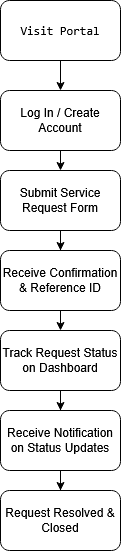
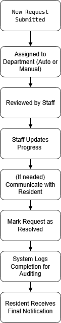

#  Council Digital Services Portal (Digital Transformation Project)

A fictional local government portal designed to showcase business systems analysis, stakeholder engagement, and digital service transformation.

---

##  Project Overview

This project simulates the end-to-end delivery of a digital council services portal. It demonstrates skills in:
- Business analysis
- Agile delivery
- Stakeholder documentation
- UX wireframing
- Workflow optimization

 **Goal:** Improve accessibility, efficiency, and transparency of council services for residents and internal staff.

---

##  Key Features

- Submit and track service requests
- Make payments (rates, fines, pet registration)
- View council news, events, and documents
- Staff-side request management
- Notification and audit trail

---

##  Project Structure

###  Business Documentation
| File | Description |
|------|-------------|
| `01_Project_Scope_and_Stakeholders.md` | Stakeholder map and project goals |
| `02_Business_Requirements_and_User_Stories.md` | Requirements matrix and user stories |
| `03_UAT_Test_Plan.md` | UAT test scenarios, expected results, and criteria |

###  Visual Models
| Diagram | Preview |
|--------|---------|
|  | **Resident User Journey** |
|  | **Back-Office Workflow** |
|  | **Resident Portal Wireframe** |

---

##  UAT (User Acceptance Testing) Summary

This test plan validates that the portal meets stakeholder requirements and is ready for live use.

| Test Case ID | Scenario                       | Expected Result                            |
|--------------|--------------------------------|---------------------------------------------|
| TC-001       | Submit service request         | Confirmation screen and request ID shown    |
| TC-002       | Track request status           | Status displayed (e.g., In Progress)        |
| TC-003       | Make payment                   | Success screen and email receipt            |
| TC-004       | View news & events             | List of updates rendered                    |
| TC-005       | Staff resolves a request       | Status changes to "Closed" + notification   |

**Acceptance Criteria:**
- 100% of critical tests must pass
- All results are signed off by stakeholders

---

##  Tools Used

- **Draw.io** – Process mapping & journey flows  
- **Figma** – UX wireframe design  
- **Markdown** – Business documentation  
- **GitHub** – Version control & publishing

---

##  Author

**Matthew D. Alagheel**  
[LinkedIn](https://www.linkedin.com/in/matthewdalagheel/) | [GitHub](https://github.com/Malagheel)

---
